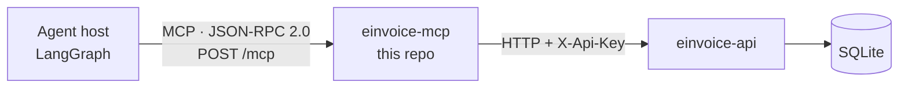

<h1 align="center">E-Invoice MCP Server</h1>

<p align="center">
  
  
  
  
</p>

<p align="center">
  <em>Exposes InvoiceNow (Peppol) e-invoice registration as agent tools over the
  Model Context Protocol.</em>
</p>

---

## What this is

An **MCP server**: a process that advertises a set of tools over a standard
protocol so any MCP-capable agent can discover and call them without knowing
anything about the service behind them.

This one wraps
[plexus-einvoice-api](https://github.com/LouisAnhTran/plexus-einvoice-api),
turning company registration and tax-submission management into six tools a
language model can use.

It holds **one secret** — the upstream API key — and **no database
credentials**. Everything it can do, it does over HTTP.

## Architecture



Three hops, three trust boundaries. **The model never sees the API key** — it
calls a tool, and this server attaches the header server-side.

## The protocol

MCP is **JSON-RPC 2.0** over a **Streamable HTTP** transport. That means one
HTTP endpoint, with the method name deciding what happens:

| JSON-RPC method | Purpose |
|---|---|
| `initialize` | handshake — exchange protocol version and capabilities |
| `tools/list` | **discover every tool, with its JSON Schema** |
| `tools/call` | invoke one tool |

```http
POST /mcp
Content-Type: application/json
Accept: application/json, text/event-stream

{"jsonrpc":"2.0","id":2,"method":"tools/list","params":{}}
```

Replies come back as SSE (`event: message` / `data: {...}`), so the server can
stream long-running results over the same connection.

The `inputSchema` in each `tools/list` entry is generated automatically by
FastMCP from Python type hints — that schema is what the agent host converts
into a tool definition for the model. Hosts call `tools/list` **once at
connection time** and cache the result; only `tools/call` runs per invocation.

## Tools

| Tool | Arguments | Hints |
|---|---|---|
| `register_company_for_einvoice` | `uen*`, `company_name*`, `country_code`, `enable_tax_submission` | |
| `get_einvoice_registration` | `uen*` | readOnly |
| `list_einvoice_registrations` | — | readOnly |
| `activate_tax_submission` | `uen*` | |
| `deactivate_tax_submission` | `uen*` | |
| `deregister_company` | `uen*` | **destructive** |

<sub>`*` required. Hints are MCP `ToolAnnotations` — clients use them to decide what needs confirmation.</sub>

### Two design decisions

**Tools take a bare UEN.** The model passes `"202400100A"`; the server builds
`iso6523-actorid-upis::0195:202400100A`. Asking an LLM to assemble that string
byte-perfectly is a reliable source of malformed identifiers.

**Errors are translated into sentences, not status codes.** A bare `401` or a
stack trace gives the model nothing to act on, so it invents an explanation for
the user. Instead:

| Upstream | What the model receives |
|---|---|
| `401` | *"The Access Point rejected the API key (401). The MCP server's EINVOICE_API_KEY does not match the one the API expects."* |
| connection refused | *"Could not reach the Access Point API at http://… (ConnectError). Check the service is running and EINVOICE_API_BASE_URL is correct."* |
| `409` | *"Tax submission is already PENDING_ACTIVATION"* |
| `404` | *"Not found: No company 999999999Z"* |

Tool results are also trimmed to the fields that matter — every byte returned
is spent as context tokens on every later turn of the conversation.

## Quickstart

Requires Python 3.11+, [`uv`](https://docs.astral.sh/uv/), and a running
[einvoice-api](https://github.com/LouisAnhTran/plexus-einvoice-api).

```bash
git clone https://github.com/LouisAnhTran/plexus-einvoice-mcp.git
cd plexus-einvoice-mcp
cp .env.example .env          # EINVOICE_API_KEY must match the API's
uv sync
.venv/bin/python -m uvicorn server:app --host 127.0.0.1 --port 9000
```

```bash
curl localhost:9000/healthz
# {"status":"ok","upstream":"http://localhost:8100","upstreamReachable":true}
```

### Poking at it

```bash
npx @modelcontextprotocol/inspector    # UI over tools/list and tools/call
```

Or raw, no SDK:

```bash
curl -s -X POST http://localhost:9000/mcp \
  -H 'Content-Type: application/json' \
  -H 'Accept: application/json, text/event-stream' \
  -d '{"jsonrpc":"2.0","id":1,"method":"tools/list","params":{}}'
```

> [!TIP]
> Quote those headers carefully. Unquoted shell expansion produces
> `Invalid HTTP request received` in the server log, which looks like a
> protocol failure and isn't.

## Configuration

| Variable | Default | Notes |
|---|---|---|
| `EINVOICE_API_BASE_URL` | `http://localhost:8100` | where the Access Point API lives |
| `EINVOICE_API_KEY` | `dev-smp-key` | **must equal** the API's `EINVOICE_API_KEY` |
| `EINVOICE_API_TIMEOUT_SECONDS` | `15` | bounded, so a hung upstream surfaces as a tool error |
| `MCP_HOST` | `127.0.0.1` | use `0.0.0.0` in a container |
| `MCP_PORT` | `9000` | |

`EINVOICE_API_KEY` is a **shared secret** — the same name is used on both
services deliberately, so one value in a compose file or Kubernetes Secret feeds
both with no drift.

## Deploying

`mcp.http_app()` returns a plain **Starlette ASGI app**, so this runs under
uvicorn like any other web service — same container pattern, same Deployment,
same env-var config.

```yaml
einvoice-mcp:
  environment:
    EINVOICE_API_BASE_URL: http://einvoice-api:8100
    EINVOICE_API_KEY: ${EINVOICE_API_KEY}     # same value as the API
    MCP_HOST: 0.0.0.0
```

Three things this server does specifically to survive Kubernetes:

**`stateless_http=True`.** By default the Streamable HTTP transport keeps
per-client session state keyed by an `Mcp-Session-Id` header. With two replicas
behind a Service and no sticky sessions, requests round-robin to a pod that has
never seen the session — intermittent, baffling failures. Stateless mode lets
any replica serve any request.

**`GET /healthz`.** A plain HTTP route, because kubelet cannot speak JSON-RPC.
It returns **503** when the upstream API is unreachable, so a failing probe
points at the actual cause:

```json
{"status":"degraded","upstream":"http://einvoice-api:8100","upstreamReachable":false}
```

**One `httpx.AsyncClient` per process**, created in the FastMCP lifespan.
Building a client per tool call throws away connection pooling and adds a TCP
handshake to every tool the agent runs.

## Layout

```
server.py     FastMCP instance, the six tools, /healthz, the ASGI app
client.py     httpx wrapper, error translation, participant-ID building
config.py     env-driven settings with explicit variable names
```

`client.py` is the only module that knows the upstream API exists — it raises a
domain-level `AccessPointError`, and `server.py` converts that into an MCP
`ToolError`. That split keeps the HTTP layer independently testable and stops
protocol concerns leaking into it.

---

<p align="center"><sub>Part of <strong>Plexus</strong> · wraps <a href="https://github.com/LouisAnhTran/plexus-einvoice-api">plexus-einvoice-api</a></sub></p>
